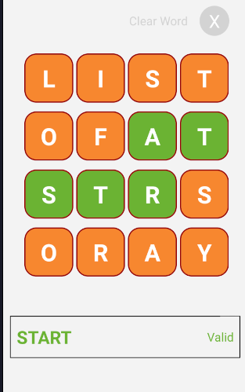

<div align="center">
  <a href="https://reactnative.dev/" target="blank"></a>
</div>
<div>

<h1 align="center"> Letters game!</h1>

> React Native

Description: Juego donde se muestran 16 letras (4x4) las cuales se van seleccionando para formar palabras. 



## Comenzando

A continuación se listarán todos los puntos necesarios para comenzar a desarrollar con el proyecto actual desde su fase de instalación hasta levantar un ambiente local de desarrollo sin problemas.

## Prerrequisitos

1. Node js
    * https://nodejs.org/es/download/
2. React Native
    * https://reactnative.dev/

## Clonación

```bash
git clone https://github.com/dplazagarrido/letters-game.git
```

## Instalación

```bash
$ yarn install
```

## Desarrollo

Ejecutar `yarn android` para un servidor de desarrollo.

```bash
$ yarn android
```